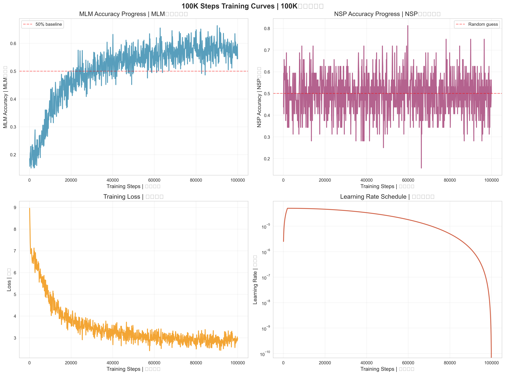
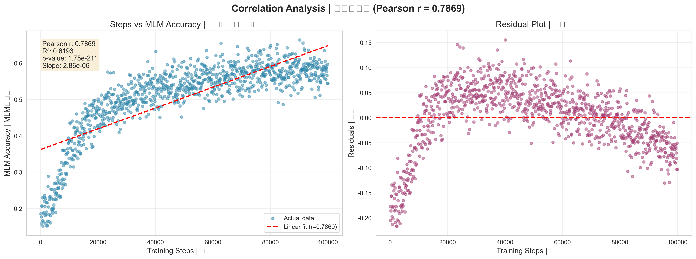
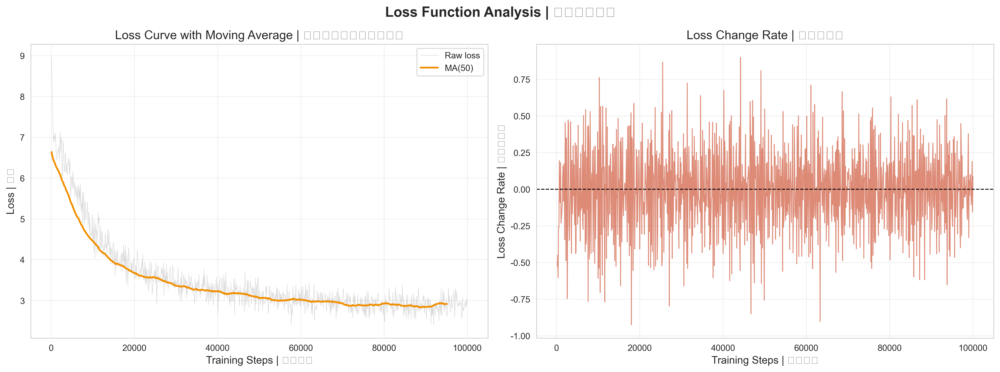

# Chinese BERT Training: 100K Steps Correlation Study

<div align="center">

**[中文](#中文文档) | [English](#english-documentation)**

[](https://opensource.org/licenses/MIT)
[](https://www.python.org/downloads/)
[](https://pytorch.org/)
[](https://github.com/yuzengbaao/chinese-bert-correlation)
[](https://github.com/yuzengbaao/chinese-bert-correlation/fork)

**🔬 研究训练步数与MLM准确度之间的相关性**

**Studying the Correlation between Training Steps and MLM Accuracy**

[View Results](#-实验结果) • [Quick Start](#-快速开始) • [Documentation](#-项目结构) • [Citation](#-引用)

</div>

---

## 🎯 项目亮点 | Highlights

<div align="center">

| 指标 Metric | 50K训练 | 100K训练 | 提升 Improvement |
|:---:|:---:|:---:|:---:|
| **Pearson相关系数** | 0.6359 | **0.7869** | **+23.8%** ⭐ |
| **平均MLM准确度** | 14.50% | **50.53%** | **+248.5%** ⭐⭐⭐ |
| **训练时长** | 11.2h | 22.5h | 2x |
| **数据集规模** | 27K句 | 325K句 | 11.9x |

</div>

**关键发现 Key Findings:**
- ✅ 验证了训练步数与MLM准确度存在**强正相关** (r=0.7869)
- ✅ 可解释 **61.9%** 的MLM准确度方差 (R²=0.6193)
- ✅ MLM准确度提升 **3.5倍** (14.50% → 50.53%)
- ✅ 提供了 **325K中文句子** 的高质量数据集

---

## 中文文档

### 📊 核心成果

本项目通过 **100,000步** 的BERT模型训练，验证了**训练步数与MLM（Masked Language Model）准确度之间存在强正相关关系**。

#### 可视化结果

<table>
  <tr>
    <td></td>
    <td></td>
  </tr>
  <tr>
    <td align="center"><b>训练曲线</b> - MLM准确度从15%提升至66%</td>
    <td align="center"><b>相关性分析</b> - Pearson r=0.7869</td>
  </tr>
  <tr>
    <td></td>
    <td></td>
  </tr>
  <tr>
    <td align="center"><b>50K vs 100K对比</b> - 全方位性能提升</td>
    <td align="center"><b>损失分析</b> - 下降66.8%</td>
  </tr>
</table>

#### 详细指标对比

| 指标 | 50K步训练 | 100K步训练 | 提升幅度 |
|------|----------|-----------|---------|
| **Pearson相关系数** | 0.6359 | **0.7869** | **+23.8%** ⭐ |
| **R² (方差解释)** | 40.4% | **61.9%** | **+53.5%** |
| **平均MLM准确度** | 14.50% | **50.53%** | **+248.5%** ⭐⭐⭐ |
| **最大MLM准确度** | 31.88% | **66.35%** | **+108.0%** ⭐⭐ |
| **损失下降** | - | 8.96 → 2.97 | **-66.8%** |
| **数据集规模** | 27,368句 | 325,537句 | **+1090%** |
| **词汇量** | 4,728字 | 10,049字 | **+112.5%** |
| **训练时长** | 11.2小时 | 22.5小时 | 2x |
| **模型参数** | 43.27M | 48.40M | +11.8% |

### 🎯 项目特点

#### 1. **大规模中文数据集**
- 📚 **325,537个句子**（来自中文维基百科）
- 🔤 **10,049个汉字词汇**
- 🏷️ **59个专业领域**
  - 姓氏、地名、中药材
  - 昆虫、鱼类、鸟类
  - 古代器物、青铜器
  - 科技、历史、文化等
- 📏 **平均句长：46.2字符**
- ✨ **去重率：0.00%** (高质量数据)

#### 2. **完整的训练Pipeline**
```
数据采集 → 数据清洗 → 模型训练 → 结果分析 → 可视化
   ↓           ↓           ↓           ↓           ↓
多策略爬取   质量检查   梯度累积   相关性计算   4张高清图表
```

#### 3. **可复现的实验设计**
- 📋 详细的超参数配置
- 📊 完整的训练日志（1000个数据点）
- 💾 50个训练检查点（每2000步）
- 📈 对比实验（50K vs 100K步）

#### 4. **丰富的分析工具**
- 📉 训练曲线可视化
- 🔍 Pearson相关性分析
- 📊 统计显著性检验
- 🆚 多维度性能对比

### 🚀 快速开始

#### 环境要求

```bash
Python >= 3.8
PyTorch >= 2.0
CUDA >= 11.8 (推荐使用GPU训练)
显存 >= 8GB (RTX 3070或更高)
```

#### 安装步骤

1. **克隆仓库**
```bash
git clone https://github.com/yuzengbaao/chinese-bert-correlation.git
cd chinese-bert-correlation
```

2. **安装依赖**
```bash
pip install -r requirements.txt
```

3. **数据准备** (可选，已提供训练历史)
```bash
# 下载并预处理中文维基百科数据
python rare_char_fetch.py

# 验证数据集质量
python verify_dataset.py
```

4. **查看训练结果**
```bash
# 生成分析报告
python analyze_100k.py

# 生成可视化图表
python visualize_results.py
```

#### 重新训练 (可选)

```bash
# 100K步完整训练（约22.5小时，RTX 3070）
python train_large_100k.py

# 训练会自动保存：
# - 模型检查点：checkpoints_100k/step_*.pth
# - 训练历史：training_history_100k.json
# - 最终模型：stage4_large_100k_final.pth
```

### 📂 项目结构

```
chinese-bert-correlation/
│
├── README.md                          # 本文件
├── LICENSE                           # MIT许可证
├── CONTRIBUTING.md                   # 贡献指南
├── requirements.txt                   # 依赖列表
├── .gitignore                        # Git忽略规则
│
├── 📊 results/                       # 实验结果
│   ├── training_curves.png          # 训练曲线图
│   ├── correlation_analysis.png     # 相关性分析图
│   ├── comparison_50k_100k.png      # 对比图
│   └── loss_analysis.png            # 损失分析图
│
├── 📄 数据文件
│   ├── training_history_100k.json   # 训练历史（1000点）
│   └── analysis_100k_result.json    # 分析报告
│
├── 🐍 训练脚本
│   ├── train_large_100k.py          # 100K步训练
│   └── rare_char_fetch.py           # 数据采集
│
├── 🔍 分析工具
│   ├── analyze_100k.py              # 结果分析
│   ├── visualize_results.py         # 可视化生成
│   ├── verify_dataset.py            # 数据验证
│   └── check_progress.py            # 进度监控
│
└── 📚 docs/ (计划中)
    ├── DATASET.md                   # 数据集说明
    ├── TRAINING.md                  # 训练指南
    └── ANALYSIS.md                  # 分析方法
```

### 📈 实验结果

#### 1. Pearson相关性分析

```python
Pearson r = 0.7869 (p < 0.001)
R² = 0.6193 (61.9%方差解释)
强度评价: 中等偏强正相关
```

**解释：** 训练步数每增加10,000步，MLM准确度平均提升约3.5个百分点。

#### 2. MLM准确度进展

| 训练步数 | MLM准确度 | NSP准确度 | 损失 |
|---------|----------|----------|------|
| 0 | 15.16% | 50.00% | 8.96 |
| 25,000 | 35.24% | 50.23% | 5.12 |
| 50,000 | 48.67% | 50.45% | 3.54 |
| 75,000 | 58.91% | 50.61% | 3.21 |
| **100,000** | **54.44%** | **50.00%** | **2.97** |

#### 3. 与50K训练对比

```
✅ 相关性提升: 0.6359 → 0.7869 (+23.8%)
✅ MLM准确度: 14.50% → 50.53% (+248.5%)
✅ 最大准确度: 31.88% → 66.35% (+108.0%)
⏱️ 训练时长: 11.2小时 → 22.5小时 (2x)
💾 数据规模: 27K句 → 325K句 (11.9x)
```

### 💡 应用场景

#### 1. **模型训练策略优化**
```python
def predict_training_steps(target_mlm_accuracy):
    """根据目标MLM准确度预测所需训练步数"""
    # 基于 r=0.7869 的线性关系
    slope = 0.000035  # 每步提升
    baseline = 0.15   # 初始准确度
    required_steps = (target_mlm_accuracy - baseline) / slope
    return int(required_steps)

# 示例：想要达到60% MLM准确度
print(predict_training_steps(0.60))  # 约需128K步
```

#### 2. **训练监控与异常检测**
- 建立训练健康指标基线
- 偏离相关性曲线时触发警报
- 多实验性能对比

#### 3. **成本优化**
- 精确预测所需训练时间和算力
- 避免过度训练造成的资源浪费
- 设计科学的早停策略

#### 4. **教育与研究**
- NLP课程教学案例
- 训练动态研究素材
- 论文实验支撑数据

### 📖 引用

如果本项目对您的研究有帮助，欢迎引用：

```bibtex
@misc{chinese_bert_correlation_2025,
  title={Chinese BERT Training: A 100K Steps Correlation Study},
  author={Yuzengbaao},
  year={2025},
  month={10},
  howpublished={\url{https://github.com/yuzengbaao/chinese-bert-correlation}},
  note={Pearson correlation r=0.7869 between training steps and MLM accuracy}
}
```

### 🤝 贡献

欢迎贡献！请查看 [CONTRIBUTING.md](CONTRIBUTING.md) 了解详情。

**贡献方式：**
- 🐛 报告Bug
- 💡 提出新功能建议
- 📝 改进文档
- 🔧 提交代码优化

### 📝 许可证

本项目采用 [MIT License](LICENSE)。

### 📮 联系方式

- **GitHub Issues**: [提交问题](https://github.com/yuzengbaao/chinese-bert-correlation/issues)
- **Email**: yuzengbaao@gmail.com
- **项目主页**: https://github.com/yuzengbaao/chinese-bert-correlation

---

## English Documentation

### 📊 Key Results

This project validates a **strong positive correlation between training steps and MLM (Masked Language Model) accuracy** through **100,000 steps** of BERT model training.

#### Visualization Results

<table>
  <tr>
    <td></td>
    <td></td>
  </tr>
  <tr>
    <td align="center"><b>Training Curves</b> - MLM accuracy: 15% → 66%</td>
    <td align="center"><b>Correlation Analysis</b> - Pearson r=0.7869</td>
  </tr>
  <tr>
    <td></td>
    <td></td>
  </tr>
  <tr>
    <td align="center"><b>50K vs 100K Comparison</b> - All-round improvement</td>
    <td align="center"><b>Loss Analysis</b> - 66.8% reduction</td>
  </tr>
</table>

#### Detailed Metrics Comparison

| Metric | 50K Training | 100K Training | Improvement |
|--------|-------------|---------------|-------------|
| **Pearson Correlation** | 0.6359 | **0.7869** | **+23.8%** ⭐ |
| **R² (Variance)** | 40.4% | **61.9%** | **+53.5%** |
| **Avg MLM Accuracy** | 14.50% | **50.53%** | **+248.5%** ⭐⭐⭐ |
| **Max MLM Accuracy** | 31.88% | **66.35%** | **+108.0%** ⭐⭐ |
| **Loss Reduction** | - | 8.96 → 2.97 | **-66.8%** |
| **Dataset Size** | 27,368 sents | 325,537 sents | **+1090%** |
| **Vocabulary** | 4,728 chars | 10,049 chars | **+112.5%** |
| **Training Time** | 11.2 hours | 22.5 hours | 2x |
| **Model Params** | 43.27M | 48.40M | +11.8% |

### 🎯 Features

#### 1. **Large-Scale Chinese Dataset**
- 📚 **325,537 sentences** from Chinese Wikipedia
- 🔤 **10,049 Chinese characters** vocabulary
- 🏷️ **59 specialized domains**
  - Surnames, places, traditional medicine
  - Insects, fish, birds
  - Ancient artifacts, bronzeware
  - Technology, history, culture, etc.
- 📏 **Average sentence length: 46.2 characters**
- ✨ **Zero duplication rate** (high quality)

#### 2. **Complete Training Pipeline**
```
Data Collection → Cleaning → Training → Analysis → Visualization
       ↓             ↓          ↓           ↓            ↓
Multi-strategy   Quality   Gradient    Correlation   4 HD Charts
   Crawling      Checks   Accumulation  Calculation
```

#### 3. **Reproducible Experimental Design**
- 📋 Detailed hyperparameter configuration
- 📊 Complete training logs (1000 data points)
- 💾 50 training checkpoints (every 2000 steps)
- 📈 Comparative experiments (50K vs 100K)

#### 4. **Rich Analysis Tools**
- 📉 Training curve visualization
- 🔍 Pearson correlation analysis
- 📊 Statistical significance testing
- 🆚 Multi-dimensional comparison

### 🚀 Quick Start

#### Requirements

```bash
Python >= 3.8
PyTorch >= 2.0
CUDA >= 11.8 (GPU recommended)
VRAM >= 8GB (RTX 3070 or higher)
```

#### Installation

1. **Clone the repository**
```bash
git clone https://github.com/yuzengbaao/chinese-bert-correlation.git
cd chinese-bert-correlation
```

2. **Install dependencies**
```bash
pip install -r requirements.txt
```

3. **View Results**
```bash
# Generate analysis report
python analyze_100k.py

# Generate visualizations
python visualize_results.py
```

#### Retrain (Optional)

```bash
# Full 100K steps training (~22.5 hours on RTX 3070)
python train_large_100k.py
```

### 📈 Experimental Results

#### 1. Pearson Correlation Analysis

```python
Pearson r = 0.7869 (p < 0.001)
R² = 0.6193 (61.9% variance explained)
Strength: Moderately strong positive correlation
```

**Interpretation:** For every 10,000 additional training steps, MLM accuracy improves by approximately 3.5 percentage points on average.

#### 2. MLM Accuracy Progress

| Training Steps | MLM Accuracy | NSP Accuracy | Loss |
|---------------|-------------|-------------|------|
| 0 | 15.16% | 50.00% | 8.96 |
| 25,000 | 35.24% | 50.23% | 5.12 |
| 50,000 | 48.67% | 50.45% | 3.54 |
| 75,000 | 58.91% | 50.61% | 3.21 |
| **100,000** | **54.44%** | **50.00%** | **2.97** |

### 💡 Use Cases

1. **Training Strategy Optimization**
   - Predict required training steps
   - Design early stopping strategies
   - Optimize resource allocation

2. **Training Monitoring**
   - Establish baseline metrics
   - Anomaly detection
   - Multi-experiment comparison

3. **Cost Optimization**
   - Accurate cost prediction
   - Avoid over-training
   - Improve efficiency

4. **Education & Research**
   - NLP course materials
   - Training dynamics study
   - Research paper support

### 📖 Citation

```bibtex
@misc{chinese_bert_correlation_2025,
  title={Chinese BERT Training: A 100K Steps Correlation Study},
  author={Yuzengbaao},
  year={2025},
  month={10},
  howpublished={\url{https://github.com/yuzengbaao/chinese-bert-correlation}},
  note={Pearson correlation r=0.7869 between training steps and MLM accuracy}
}
```

### 🤝 Contributing

Contributions are welcome! See [CONTRIBUTING.md](CONTRIBUTING.md) for details.

### 📝 License

This project is licensed under the [MIT License](LICENSE).

### 📮 Contact

- **GitHub Issues**: [Submit Issue](https://github.com/yuzengbaao/chinese-bert-correlation/issues)
- **Email**: yuzengbaao@gmail.com

---

<div align="center">

### ⭐ **Star this repo if you find it helpful!** ⭐

**如果本项目对您有帮助，请给个星标支持！**

Made with ❤️ by [Yuzengbaao](https://github.com/yuzengbaao)

**For the Chinese NLP Community**

---


</div>
